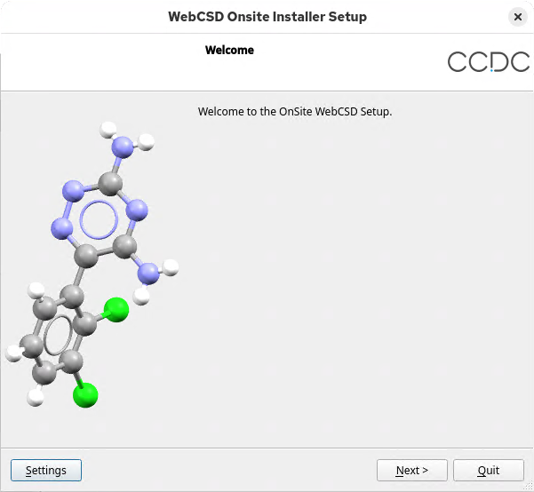
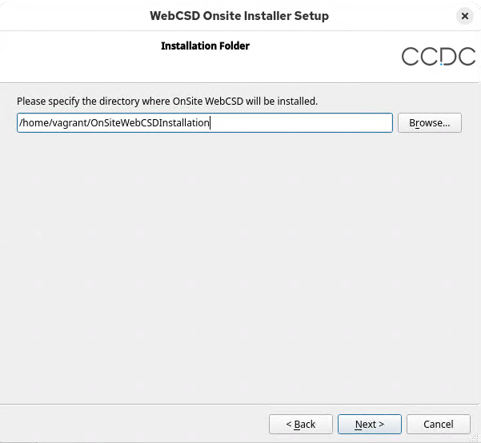
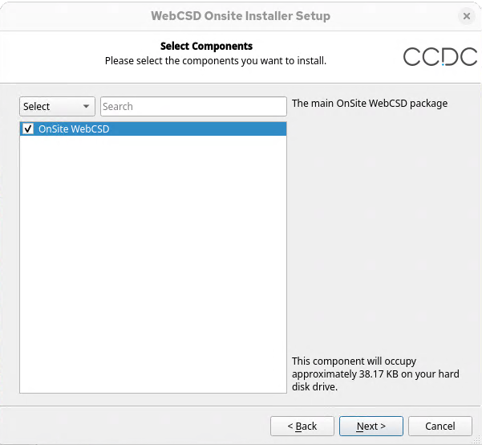
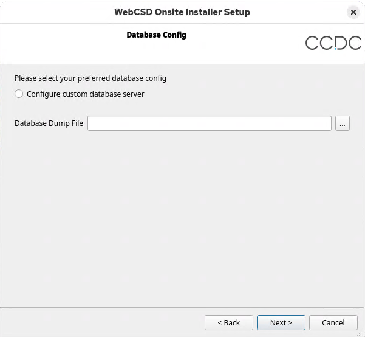

# On-Site Lattice and WebCSD

## Table of contents

- [Introduction](#introduction)
- [Prerequisites and Setup](#prerequisites-and-setup)
  - [System Requirements](#system-requirements)
  - [SELinux](#selinux)
  - [Authentication](#authentication)
  - [Docker Installation](#docker-installation)
  - [Postgres CSD Database](#postgres-csd-database)
  - [CCDC User Account](#ccdc-user-account)
- [Basic Configuration and Installation](#basic-configuration-and-installation)
  - [GUI Installation](#gui-installation)
  - [Command Line Installation](#command-line-installation)
  - [Post-Installation Checks](#post-installation-checks)
- [Further Configuration](#further-configuration)
  - [User Access Control](#user-access-control)
  - [In-House Database Configuration](#in-house-database-configuration)
  - [CSD-Theory Web Database Configuration](#csd-theory-web-database-configuration)
  - [Other Customisations](#other-customisations)
- [Changing license Keys](#changing-license-keys)
- [Updates](#updates)
  - [Installer](#installer)
  - [Manual Updates](#manual-updates)
- [Known Issues](#known-issues)
  - [Restart the message queue](#restart-the-message-queue)
- [Contacting Support](#contacting-support)

## Introduction

On-Site Lattice and WebCSD is currently only available to CCDC industrial customers and other invited groups.

This readme contains information required for installation and updates of On-Site Lattice and WebCSD.

Terms and conditions can be found in the `LICENSE.md` file.

Additional information including user configuration and troubleshooting can be found in the wiki at <https://github.com/ccdc-opensource/on-site-webcsd/wiki>.

:warning: **Note, the latest 4.3.0 release does not support CSD-Theory, Macromolecule Hub or the Prototypes plugin. Do not
update to this version if you are currently using those components.**

## Prerequisites and Setup

### System Requirements

A docker server is required to run On-Site WebCSD. In the standard configuration the postgres server for CSD and Identity databases will also run in a docker
container but there is an option to host this separately.

Recommended requirements for docker server hosting postgres container without Macromolecule Hub:

- 130GB free HD space, 16GB RAM, 8 core CPU.

Recommended requirements for Docker server hosting On-Site Lattice and WebCSD containers only:

- 30GB free HD space, 16GB RAM, 8 core CPU.

If self-hosting the postgres server, see [Setting up a self-hosted Postgresql server](https://github.com/ccdc-opensource/on-site-webcsd/wiki/Setting-up-a-self%E2%80%90hosted-PostgreSQL-server)
for system requirements.

On-Site Lattice and WebCSD should work with any OS that meets the requirements to run Docker, but official support is provided by CCDC on the following platforms.
Note that these match the 2025.3 CSD Portfolio Desktop release.

- RedHat Enterprise Linux 8, 9 and 10
- Rocky Linux 8, 9 and 10
- Ubuntu LTS 22 and 24

The libraries required for running the installer are the same as for installing the CSD Portfolio.

On RHEL / Rocky Linux 8 or 9:

```sh
sudo dnf install nss libXScrnSaver libglvnd-opengl libgfortran libxkbcommon-x11 xcb-util-wm xcb-util-cursor xcb-util-keysyms libatomic tk
```

On RHEL / Rocky Linux 10:

```sh
sudo dnf install nss libXScrnSaver libglvnd-opengl libgfortran libxkbcommon-x11 xcb-util-wm xcb-util-cursor xcb-util-keysyms libatomic libquadmath xdg-utils libXmu tk
```

On Ubuntu:

```sh
sudo apt-get install libnss3 libxss1 libopengl0 libgfortran5 libxkbcommon-x11-0 libxcb-xinerama0 libxcb-cursor0 libxcb-keysyms1 libatomic1 libtk8.6 tk8.6
```

### SELinux

The Qt installer will not run correctly if SELinux is in enforcing mode. If using RHEL / Rocky Linux, temporarily set SELinux to permissive mode.

```sh
sudo setenforce 0
```

### Authentication

- A valid CCDC activation key (a 36-character key in the format ######-######-######-######-######-######)
  will be required to use the software.
- Connecting to your WebCSD server via https is now required. To configure this you will need a password-protected .pfx
  certificate.

```sh
# To generate a self-signed certificate

# Generate private key (OpenSSL will prompt for a password)
openssl genrsa -out private.key 2048

# Generate certificate signing request (CSR)
openssl req -new -key private.key -out request.csr

# Generate self-signed certificate (valid for 365 days)
openssl x509 -req -days 365 -in request.csr -signkey private.key -out certificate.crt

# Bundle into .pfx
openssl pkcs12 -export -out certificate.pfx -inkey private.key -in certificate.crt
```

- On-Site WebCSD is installed via Docker, which requires access to the CCDC docker container registry.
  To obtain a username and password please contact CCDC Support.

### Docker Installation

A standard Docker Server and Docker Compose installation is required for installation of WebCSD.
If you are new to Docker we recommend installing the latest version of [Docker Desktop](https://docs.docker.com/get-started/introduction/get-docker-desktop/).
Note that this is likely to [require a license](https://www.docker.com/legal/docker-subscription-service-agreement/)
for most use-cases. Alternatively, [Rancher Desktop](https://rancherdesktop.io/) is an open-source alternative.

Linux users also have the option to install [Docker Engine](https://docs.docker.com/engine/install/#server) and the
[Docker Compose plugin](https://docs.docker.com/compose/install/).

CHECK: Test your Docker installation as described at the above links.
Also verify that you can log into the CCDC docker container registry:

```sh
docker login -u <user> -p <password> ccdcrepository.azurecr.io

# or to be prompted for the password
docker login -u <user> --password-stdin ccdcrepository.azurecr.io
```

### Postgres CSD Database

The postgres CSD database will be provided via a download link. To obtain this, please contact CCDC Support.

If self-hosting the postgres server please follow the instructions at [Setting up a self-hosted Postgresql server](https://github.com/ccdc-opensource/on-site-webcsd/wiki/Setting-up-a-self%E2%80%90hosted-PostgreSQL-server)

### CCDC User Account

Containers run as the account with numeric uid 1397 and you will need to create this account and add it to the `docker` group.
We suggest giving it the username `ccdc`.

```sh
# As of v2.0.0, containers run as non root users.
# Because of this you will need to create the CCDC user if it does not already exist.
sudo adduser ccdc --uid=1397

# If you are upgrading from an older version to v4.0.0, ensure the user id is set to 1397
sudo usermod -u 1397 ccdc

# Create the docker group and add the CCDC user to it.
sudo groupadd docker
sudo usermod -aG docker ccdc
```

**All installation methods (manual/installer) must be run from the `ccdc` account so that all file permissions are set up correctly.**

```sh
# For updating to 4.3.0, "ccdc" needs read access to the necessary docker volumes.
sudo chown -R ccdc:ccdc lic
sudo chown -R ccdc:ccdc userdata
```

## Basic Configuration And Installation

The installer is available from [the release tab](https://github.com/ccdc-opensource/on-site-webcsd/releases)
to run either via a GUI or command-line interface.

### GUI installation

1. From the first screen, the **settings** button gives options for *Network*, *Repositories* and *Local cache*
   configuration. Click **Next** to continue with the setup

   

2. The next screen prompts for an installation directory (note [system requirements](#system-requirements))

   

3. The next screen details the components that will be installed, the current 4.3.0 release contains
   a single main package.

   

4. At the next stage, the configuration details required for setting up the server are required. This
   includes the location of the .pfx file and the associated password, the CCDC license key and the public URI
   for the server.

   - If no .pfx file is provided a built-in self-signed certificate will be used. This is not recommended as
     it is insecure, and will not work with SSO authentication.

   - The public URI has the format `https://full.docker.hostname:PORT` where `full.docker.hostname` is your
     Docker host and `PORT` is a port number of your choice (e.g. 443).

     

5. The following screen covers options for installing the CSD database. If the database has been
   downloaded as a Dump file there is an option to navigate directly to the location. Alternatively,
   a custom configuration for the database server can be specified by adding the Server, Port, User and
   Password.

   

   :warning: **Note: Installation of the database may overwrite any existing user data,
   be sure to export any required data prior to running the installation**

6. The installation is now ready to proceed. From the final screen, click the **Install** button
   to begin the process.

During the installation a `.env` file and some `.yml` files will be created in the installation directory.
These are docker compose config files and can be edited to customise your installation.

### Command Line Installation

It is also possible to run the WebCSD installer from the command line. This process is documented on the
wiki under [Alternative ways to setup On-Site WebCSD](https://github.com/ccdc-opensource/on-site-webcsd/wiki/Alternative-ways-to-setup-On-Site-WebCSD)

### Post-Installation Checks

CHECK: To check that the install has completed and that all the services are running,
either view the containers in the Docker Desktop GUI or run:

```sh
docker compose ps
```

which should show the state of the services to all be `Up`. If any services have the state `Up (unhealthy)` or `Exit` then restart the stack.
Take care to include the right config files as in the commands below.

```sh
docker compose -f docker-compose.yml -f docker-compose.ssl.yml down
docker compose -f docker-compose.yml -f docker-compose.ssl.yml up -d
```

If the issues persist then please contact CCDC Support.

To access the On-Site Lattice and WebCSD service locally go to the WebCSD server URL you entered
at install time.

To check that you can search the CSD you must create an account.

If you have problems check your `.env` file.

- The correct format for the `CCDC_LICENSING_CONFIGURATION` line is
  `CCDC_LICENSING_CONFIGURATION=la-code;ACTIVATION_KEY;`.
- `PUBLIC_URI` should be set to the full URL of your WebCSD server including the port number.
  This must resolve to your docker host.
- `PLATFORM_PORT` must match the port number in `PUBLIC_URI` (default is 443).

## Further Configuration

Your On-Site WebCSD server is now up and running but you will probably need to configure user access control
and in-house databases. This is done via docker compose files
(see [WebCSD Configuration Files](https://github.com/ccdc-opensource/on-site-webcsd/wiki/WebCSD-configuration-files) in the wiki).
After making any changes to these files, restart the stack as described above, adding any docker compose files
which you have customised into the `docker compose ... up -d` command.

### User Access Control

User access control can be managed via local accounts or Single Sign-On (SSO). You must configure roles to allow
access to in-house databases as by default even admin roles can only access the CSD.
For details please see [Access Control To In-House Databases](https://github.com/ccdc-opensource/on-site-webcsd/wiki/Access-control-to-in-house-databases).

### In-house Database Configuration

On-Site Lattice and WebCSD can be configured to read from in-house databases.

Provided within the installation is a sample database `teaching-subset.csdsql` which can be found in the `sample-data` folder in the root of the installation.

For the latest version 4.3.0 release, details on in-house database configuration are available from the
[wiki](https://github.com/ccdc-opensource/on-site-webcsd/wiki/Updating-your-in‐house-databases)

For earlier releases (version 4.2.1) the following information is still applicable:

To enable in-house databases:

1. Copy and rename the file `docker-compose.sample-On-Site-only-db-config.yml` to `docker-compose.db-config.yml`
2. Edit the `volumes` section of that file to point to any in-house databases and edit the `environment` section to configure the application to recognise these databases.
Ensure that all instances of 'database-1' or 'database-2' are replaced with the actual database name.

For example, to use the 'teaching_subset.csdsql' database and have it appear as a database named 'Example', your docker-compose.db-config.yml should look like:

```yml
volumes:
    - /path/to/webcsd/sample-data/teaching_subset.csdsql:/csd-data/teaching_subset.csdsql
environment:
    - ServiceSettings__Databases__2__Name=Example
    - ServiceSettings__Databases__2__ConnectionString=/csd-data/teaching_subset.csdsql
```

More information is given in the notes & example sections of the sample file. This acts as an [override file](https://docs.docker.com/compose/extends/) which you will have to include in the startup command.

### CSD-Theory Web Database Configuration

Instructions on setting up CSD-Theory Web can be found in the [wiki](https://github.com/ccdc-opensource/on-site-webcsd/wiki/Setting-up-CSD%E2%80%90Theory-Web).

Provided within the installation is a sample CSD-Theory landscape database `CSPLandscape.csdsqlx` which can be found in the `sample-data` folder in the root of the installation,
along with a blank `CSPDatabase.db` CSD-Theory metadata database.

### Other Customisations

For other optional customisations to your WebCSD server please see [WebCSD Configuration and Customisation](https://github.com/ccdc-opensource/on-site-webcsd/wiki/WebCSD-Configuration-&-Customisation).

## Changing license Keys

To change your license key you must delete the license volume and restart the stack:

```sh
# Append -f docker-compose.insecure-configuration.yml and docker-compose.postgres.yml if needed.
docker compose -f docker-compose.yml -f docker-compose.ssl.yml down
rm -r lic
docker compose -f docker-compose.yml -f docker-compose.ssl.yml up -d
```

## Updates

### Installer

To update your installation, re-run the maintenance tool and select the same installation folder.
Click Ok when a warning message pops up.
This will automatically pull the latest versions of all containers and restart the stack.

For major releases a new database dump file is shipped. The installer will prompt for the location. It will then overwrite the csd database volume with the update, please export any in-house databases beforehand. Once the update has completed they will need to be reimported within lattice -> database management.

Contact CCDC Support for the latest download link.

### Manual Updates

For major releases export any in-house databases, recreate the csd-database and [restore](https://github.com/ccdc-opensource/on-site-webcsd/wiki/Setting-up-a-self%E2%80%90hosted-PostgreSQL-server#restore-database) it with a new database dump provided by Support.

```sh
# Append -f docker-compose.insecure-configuration.yml and docker-compose.postgres.yml if needed.
docker compose -f docker-compose.yml -f docker-compose.ssl.yml down
docker compose pull
docker compose -f docker-compose.yml -f docker-compose.ssl.yml up -d
```

Now from lattice -> database management, reimport your in-house databases.

## Known Issues

### Restart the message queue

With 4.3.0 rabbitmq needs to be rerun. If you are installing manually please run the following:

```sh
docker compose -f docker-compose.yml up -d
```

## Contacting Support

If you experience any difficulties with installing or using On-Site Lattice and WebCSD, please contact our support team at <support@ccdc.cam.ac.uk> who will be happy to assist you.
